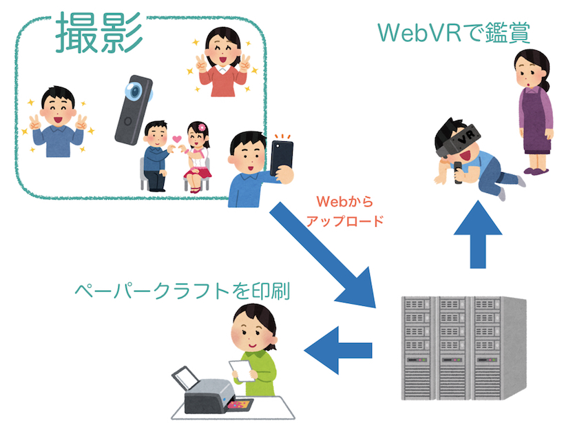
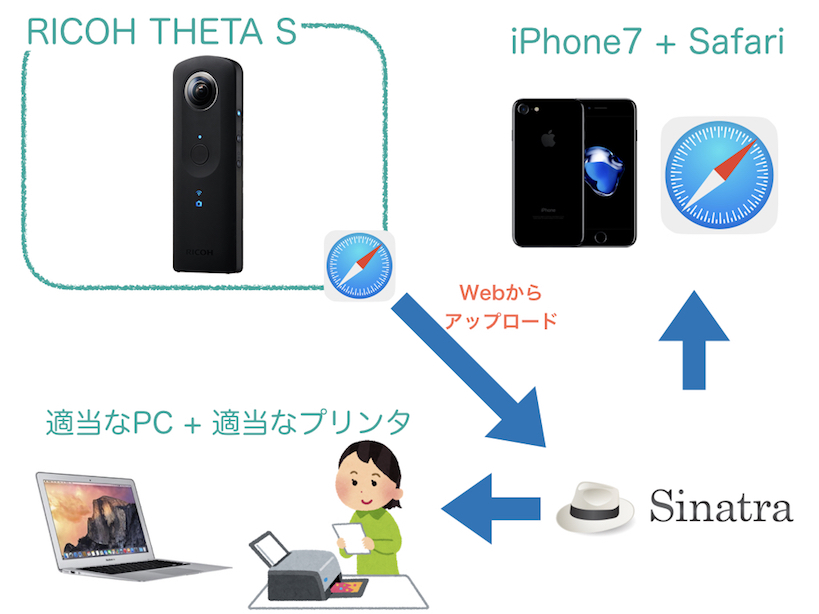
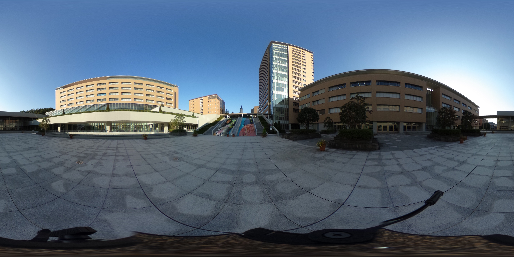

## 360°天球写真で ペーパークラフトを作る

2017/11/22  
社内勉強会@スタジオアルカナ  
スタジオアルカナ  
遠藤勝也

---

# 概要

>>>

>>>

---

## 出来上がったペーパークラフト

>>>

>>>

---

# 使用技術

>>>

- サーバ
	- [Sinatra](https://github.com/sinatra/sinatra)
		- Rubyの軽量なWebフレームワーク
		
	- [pazucraft](https://github.com/endoh0509/pazucraft)
		- 天球写真からペーパークラフト生成用のGem
		- 本家は[こちら](https://github.com/chihayafuru/pazucraft)
- クライアント
	- [A-Frame](https://aframe.io/)
		- WebVRフレームワーク

---

# デモ

>>>

[ここ(公開はしない)](http://153.126.169.253:4567/)

---

### ありがとうございました
